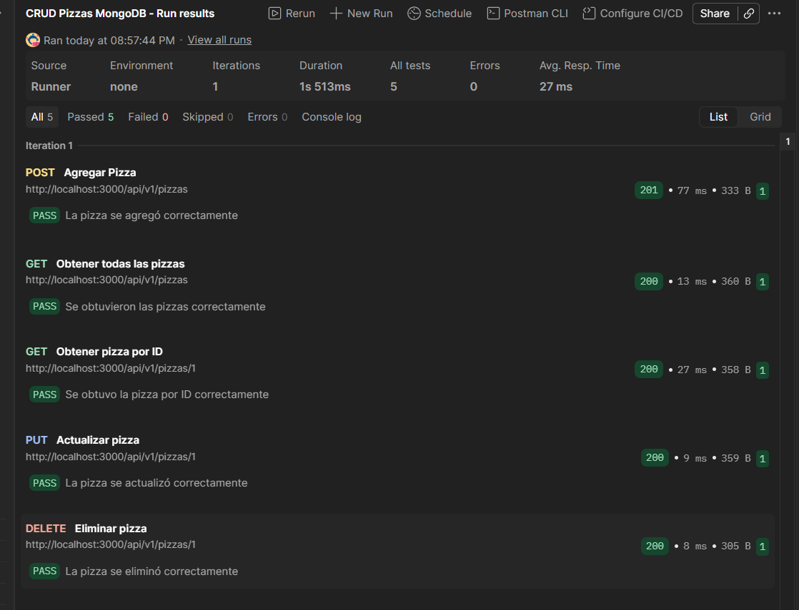

# CRUD de Pizzas con Node.js y MongoDB

## Descripción

Este proyecto consiste en un CRUD de pizzas desarrollado con Node.js y Express. Originalmente los datos se almacenaban en memoria mediante una lista, pero se modificó el repositorio para utilizar una base de datos MongoDB.

MongoDB se ejecuta dentro de un contenedor de Docker y la aplicación se conecta a la base de datos para realizar las operaciones de crear, consultar, actualizar y eliminar pizzas.

## Tecnologías utilizadas

- Node.js
- Express
- MongoDB
- MongoDB Compass
- Docker
- Postman

## Instalación

Primero se debe clonar el repositorio:

```bash
git clone URL_DEL_REPOSITORIO
```

Después entrar a la carpeta del proyecto:

```bash
cd HolaMundoV2_nodejs
```

Instalar las dependencias:

```bash
npm install
```

## Base de datos MongoDB

Para ejecutar MongoDB se utiliza Docker.

Se puede crear y ejecutar el contenedor con el siguiente comando:

```bash
docker run -d --name mongodb-pizzas -p 27017:27017 mongo
```

La cadena de conexión utilizada por el proyecto es:

```text
mongodb://localhost:27017
```

La aplicación utiliza la base de datos:

```text
pizzeria
```

y la colección:

```text
pizzas
```

También se puede utilizar MongoDB Compass para visualizar la base de datos utilizando la misma cadena de conexión.

## Ejecutar el proyecto

Para iniciar el servidor en modo desarrollo se utiliza:

```bash
npm run dev
```

El servidor se ejecuta en:

```text
http://localhost:3000
```

## Endpoints

### Obtener todas las pizzas

```http
GET /api/v1/pizzas
```

### Obtener una pizza por ID

```http
GET /api/v1/pizzas/1
```

### Agregar una pizza

```http
POST /api/v1/pizzas
```

Ejemplo del Body:

```json
{
    "id": 1,
    "nombre": "Hawaiana",
    "descripcion": "Jamon y piña"
}
```

### Actualizar una pizza

```http
PUT /api/v1/pizzas/1
```

Ejemplo del Body:

```json
{
    "nombre": "Hawaiana Especial",
    "descripcion": "Jamon, piña y extra queso"
}
```

### Eliminar una pizza

```http
DELETE /api/v1/pizzas/1
```

## Pruebas con Postman

Para comprobar el funcionamiento del CRUD se creó una colección en Postman con las siguientes pruebas:

1. Agregar una pizza.
2. Obtener todas las pizzas.
3. Obtener una pizza por ID.
4. Actualizar una pizza.
5. Eliminar una pizza.

La colección se ejecutó utilizando el Collection Runner de Postman.

Resultado obtenido:

- 5 pruebas ejecutadas.
- 5 pruebas aprobadas.
- 0 pruebas fallidas.
- 0 errores.

## Evidencia de las pruebas



## Estructura principal del proyecto

```text
HolaMundoV2_nodejs
│
├── capturas
│   └── testing-postman.png
│
├── repositorios
│   └── pizza.repositorio.js
│
├── servicios
│   └── nasa.servicio.js
│
├── index.js
├── package.json
├── package-lock.json
└── readme.md
```

## Funcionamiento

El archivo `index.js` contiene las rutas de la API realizadas con Express.

El archivo `pizza.repositorio.js` contiene las funciones encargadas de comunicarse con MongoDB. En este archivo se realizan las operaciones de consulta, inserción, actualización y eliminación de las pizzas.

De esta manera los datos dejan de almacenarse únicamente en memoria y pasan a persistirse en MongoDB.